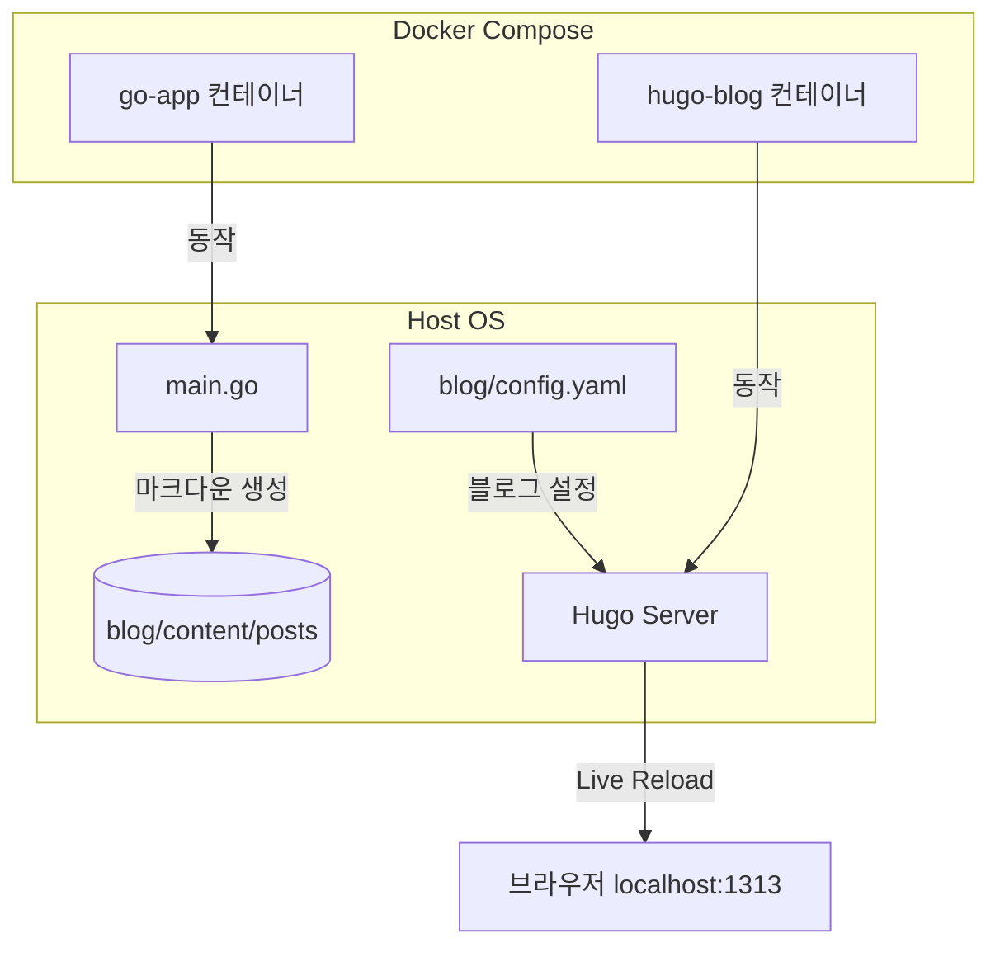

# 🚀 Go + Hugo 블로그 프로젝트

이 프로젝트는 **Go 자동화 스크립트**와 **Hugo 정적 사이트 생성기(Static Site Generator)**를 **Docker Compose** 환경으로 통합하여, 로컬에서 실시간으로 블로그를 집필하고 테스트 글을 자동으로 생성할 수 있도록 구축된 개발용 블로그 환경입니다.

---

## 📌 주요 구성 요소 및 아키텍처

이 프로젝트는 크게 두 개의 컨테이너 서비스로 구성되어 있습니다.



### 1. Hugo 블로그 서버 (`hugo-blog`)
* **이미지**: `hugomods/hugo:exts` (확장 기능 포함 Hugo 최신 이미지)
* **역할**: `./blog` 폴더를 컨테이너 내 `/src`에 마운트하여, 마크다운 문서 및 테마 변경 사항을 감지하고 브라우저에 실시간으로 반영(`--watch`)합니다.
* **주요 경로**:
  * [config.yaml](file:///home/g015/project/go-hugo-blog/blog/config.yaml): 블로그 기본 메타데이터, 테마(`seotax`), 메뉴 및 SEO 설정이 포함되어 있습니다.
  * [content/posts](file:///home/g015/project/go-hugo-blog/blog/content/posts): 블로그 글(마크다운 파일)이 저장되는 위치입니다.

### 2. Go 자동화 컨테이너 (`go-app`)
* **베이스 이미지**: `golang:1.22-alpine`
* **역할**: 컨테이너 실행 시 [main.go](file:///home/g015/project/go-hugo-blog/main.go) 스크립트를 빌드 및 실행하여 Front Matter 형식의 날짜 기반 마크다운 테스트 포스팅을 `blog/content/posts/` 하위에 자동으로 생성합니다.
* **동작 방식**: 
  * 로컬 시간대(`Asia/Seoul`)를 적용하여 파일명에 생성 시간을 기록합니다.
  * Docker Compose 빌드 흐름을 테스트하거나 자동 포스팅 파이프라인의 기초로 활용됩니다.

---

## 🛠️ 실행 및 사용 방법

### 1. 전체 서비스 실행 (Docker Compose)
터미널에서 아래 명령을 실행하여 Hugo 서버 및 Go 자동 포스팅 테스트 앱을 실행할 수 있습니다.
```bash
docker compose up --build -d
```
* **블로그 접속**: 웹 브라우저에서 `http://localhost:1313` 으로 이동하면 생성된 글과 카테고리를 실시간으로 확인할 수 있습니다.
* **테스트 글 자동 생성**: `go-app` 컨테이너가 뜰 때마다 새로운 테스트 마크다운이 추가됩니다.

### 2. Go 스크립트 단독 실행 (로컬)
도커 없이 로컬 Go 환경에서 포스팅 생성기 스크립트만 단독으로 테스트하려면 아래 명령어를 사용합니다.
```bash
go run main.go
```
실행 완료 시 `blog/content/posts/YYYY-MM-DD-HHMMSS-docker-test.md` 형태의 파일이 생성됩니다.

---

## ⚖️ 라이선스 및 출처 고지 (License & Credits)

이 블로그의 디자인과 레이아웃은 [minyeamer의 hugo-seotax 테마](https://github.com/minyeamer/hugo-seotax)를 기반으로 커스텀하여 제작되었습니다. 

해당 테마는 **MIT 라이선스** 하에 제공되며, 아래와 같이 원저작자 표기 및 라이선스 고지 의무를 준수합니다.

* **원저작자 (Original Author)**: [minyeamer](https://github.com/minyeamer)
* **원본 저장소 (Original Repository)**: [hugo-seotax](https://github.com/minyeamer/hugo-seotax)
* **라이선스 (License)**: MIT License (Copyright (c) minyeamer)

